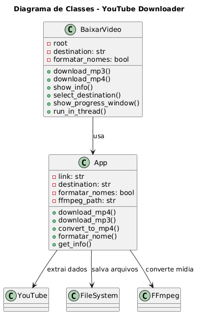
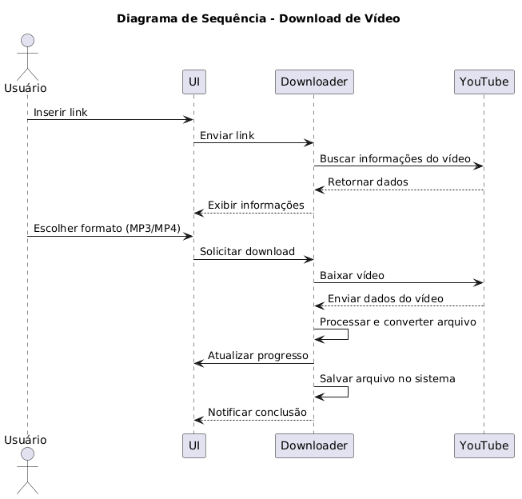
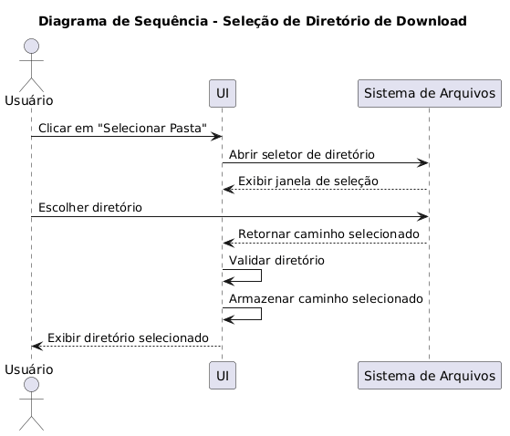
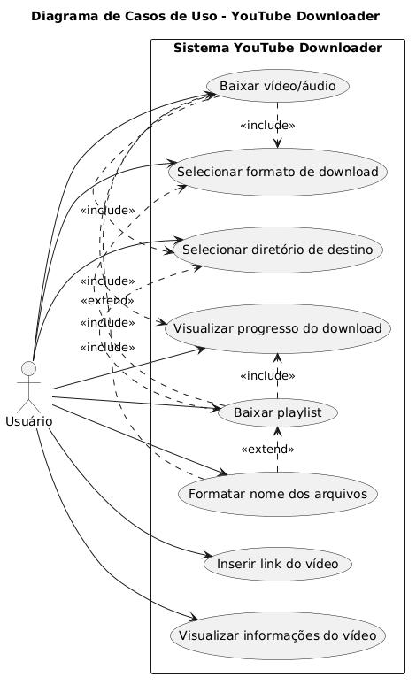

# Diagramas do Sistema

Esta pasta contém os diagramas utilizados na modelagem e documentação do sistema.

Os diagramas representam visualmente o funcionamento da aplicação, facilitando a compreensão da arquitetura, dos fluxos e das interações entre os componentes.

---

## Diagrama de Classes

[🔗 Ver no GitHub](https://github.com/Deoxu/yt-media-downloader/blob/master/docs/diagrams/class-diagram.png)

  

---

## Diagrama de Sequência – Download

[🔗 Ver no GitHub](https://github.com/Deoxu/yt-media-downloader/blob/master/docs/diagrams/sequence-download.png)

  

---

## Diagrama de Sequência – Seleção de Diretório

[🔗 Ver no GitHub](https://github.com/Deoxu/yt-media-downloader/blob/master/docs/diagrams/sequence-select-directory.png)

  

---

## Diagrama de Casos de Uso

[🔗 Ver no GitHub](https://github.com/Deoxu/yt-media-downloader/blob/master/docs/diagrams/use-case.png)

  

---

## Ferramentas utilizadas

- PlantUML – criação dos diagramas de sequência  
- draw.io – criação do diagrama de casos de uso  

---

## Observações

Os diagramas representam uma visão simplificada do sistema e podem ser atualizados conforme a evolução do projeto.
